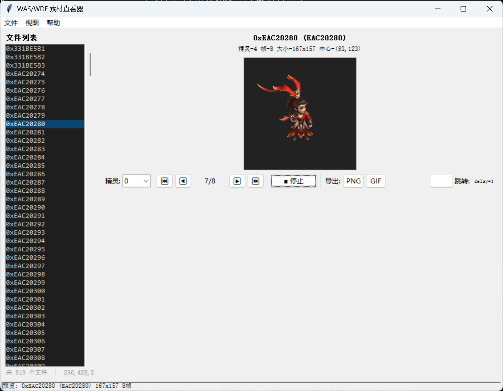

# GGE-Tool

A cross-format game asset viewer and parser for **GGE** (Game Graphics Engine) resource files.

Supports **WAS** (sprite/animation), **WDF** (WAS archive), and **MAP** (scene/map) file formats.

## Features



- **WAS Viewer** — View sprite frames, play animations, export PNG/GIF
- **WDF Browser** — Browse and extract WAS files from WDF archives
- **MAP Viewer** — Parse and render game maps (.map) with:
  - Automatic JPEG grid layout detection (GNP / GEPJ / 2GPJ formats)
  - Sub-tile replacement via segment offset index tables
  - Center-aligned map canvas rendering
  - Support for large maps (tested up to 840 images, 17MB+ files)
- **Export** — Export WAS frames as PNG, animations as GIF, maps as PNG

## Supported Formats

| Format | Description | Versions |
|--------|-------------|----------|
| `.was` | Sprite animation (indexed palette, RLE) | WAS v1 / v2 |
| `.wdf` | WAS file archive container | v1 |
| `.map` | Scene/map with embedded JPEG tiles | Format 1 (1GNP) / Format 2 (GEPJ/2GPJ) |

## Requirements

- Python 3.8+
- Pillow
- OpenCV (cv2)
- NumPy

## Installation

```bash
pip install -r requirements.txt
```

## Usage

### GUI Application

```bash
python was_ui.py
```

### Programmatic API

```python
# Parse a WAS file
from was_parser import load_was
was = load_was("sprite.was")

# Parse a MAP file
from map_parser import load_map
mf = load_map("scene.map")

# Render a MAP to image
from map_renderer import render_map
img = render_map("scene.map")
img.save("scene.png")

# Export WAS frame as PNG/GIF
from was_viewer import export_frame_png, export_gif
export_frame_png(was, 0, 0, "frame0.png")
export_gif(was, "anim.gif")
```

## File Structure

```
├── was_parser.py      # WAS sprite parser
├── wdf_parser.py      # WDF archive parser
├── was_viewer.py      # WAS rendering and export utilities
├── was_ui.py          # Tkinter GUI application
├── map_parser.py      # MAP file format parser
├── map_renderer.py    # MAP rendering engine
├── README.md
├── LICENSE
└── requirements.txt
```

## 中文版本

[中文说明](README_zh.md)

## License

MIT
